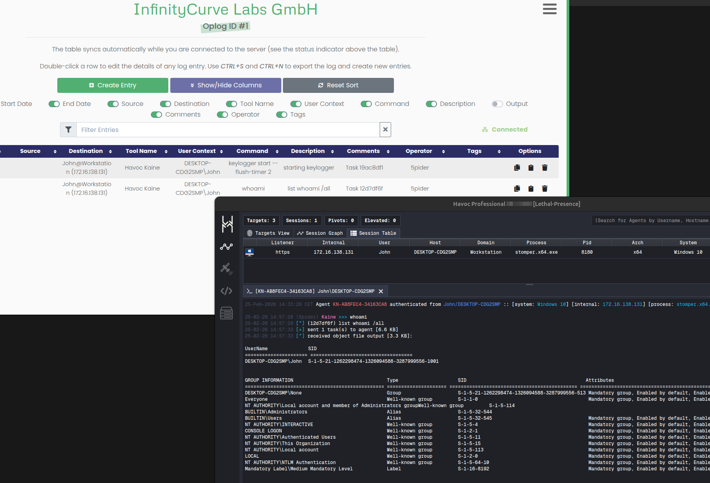

# Ghostwrite Sync Plugin

This havoc backend plugin allows ingest events and post these events to the Ghostwriter GraphQL API to create real-time activity logs.

This plugin automatically logs all operator's commands, comments, and output into Ghostwriter so operators can focus more on technical execution and less on manual and tedious logging and reporting activities.

## Build

To build it from source, the following steps are to be made: 
```
git clone https://github.com/InfinityCurveLabs/ghostwriter-sync
cd ghostwriter-sync
make
```

Once build copy the generated plugin.hc along side with the plugin json metadata to its own directory under the TeamServer plugins directory:
```
mkdir <HAVOC_TEAMSERVER>/plugins/ghostwriter
cp plugin.* <HAVOC_TEAMSERVER>/plugins/ghostwriter
```

This way the TeamServer will automatically register the plugin on startup.

## Configure 

A single toml file is needed to configure the plugin with the necessary domain endpoint, api-token, and operation id. 

```toml
[kaine.ghostwriter]
   domain       = 'https://127.0.0.1'
   api-token    = '<YOUR API TOKEN>'
   operation-id = 1
```

Once configured, we can tell the TeamServer to use the given configuration for the ghostwriter sync plugin.

```
./havoc server profiles/* ghostwriter.toml
```

## Preview

An example preview of how it looks once successfully running 



## References

- [mythic_sync](https://github.com/GhostManager/mythic_sync) - Automated activity logging utility for Mythic C2 
- [Ghostwriter](https://github.com/GhostManager/Ghostwriter) - Engagement Management and Reporting Platform
- [Ghostwriter's Official Documentation - Operation Logging w/ Ghostwriter](https://ghostwriter.wiki/features/operation-logs) - Guidance on operation logging setup and usage with Ghostwriter
